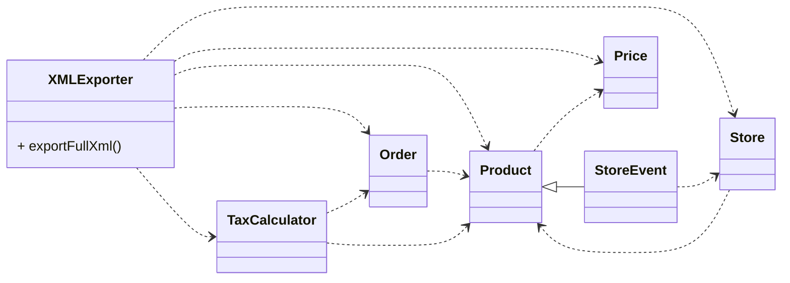
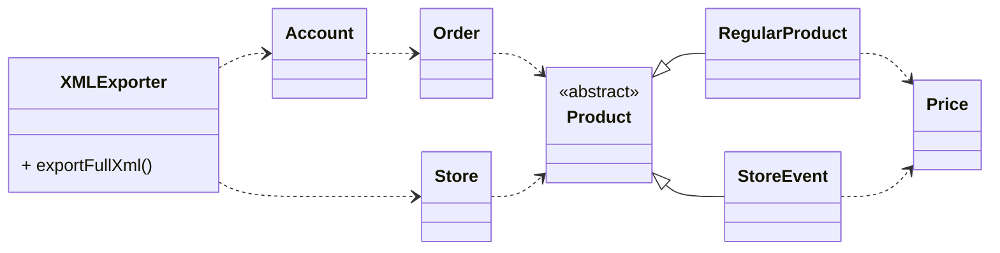

# Problem: Dependency Mess



---
transition: fade
---

# Problem: Dependency Mess

```java {all|8|10|13-14|17,19|21}
public static String exportFull(Collection<Order> orders) {
    StringBuilder xml = new StringBuilder();
    xml.append("<?xml version=\"1.0\" encoding=\"UTF-8\"?>");
    xml.append("<orders>");
    for (Order order : orders) {
        xml.append("<order");
        xml.append(" id='");
        xml.append(order.getId());
        xml.append("'>");
        for (Product product : order.getProducts()) {
            xml.append("<product");
            ...
            if (product.isEvent()) ...
            if (product.getWeight() > 0) ...
            xml.append("<price");
            xml.append(" currency='");
            xml.append(product.getPrice().getCurrency());
            xml.append("'>");
            xml.append(product.getPrice().getAmount());
            xml.append("</price>");
            xml.append(product.getName());
            xml.append("</product>");
            ...
```

---
transition: fade
---

# Goal



---
transition: fade
---

# Goal

```java
public static String exportFull(Account account) {
    return XML_HEADER + account.xml();
}

public static String exportStore(Store store) {
    return XML_HEADER + store.xml();
}
```
