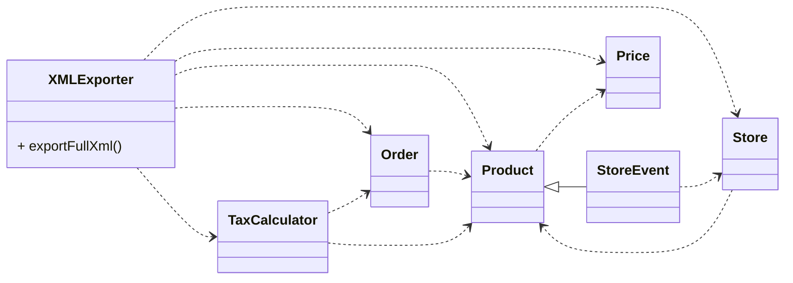
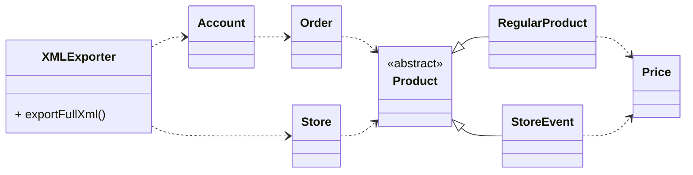

# The problem: dependency mess

```mermaid
classDiagram
    direction LR
    Product <|-- StoreEvent
    XMLExporter ..> Product
    XMLExporter ..> Store
    XMLExporter ..> Price
    XMLExporter ..> Order
    StoreEvent ..> Store
    Store ..> Product
    Order ..> Product
    Product ..> Price
    XMLExporter ..> TaxCalculator
    TaxCalculator ..> Order
    TaxCalculator ..> Product
    class XMLExporter {
        + exportFullXml()
    }
```

---

# The goal

```mermaid
classDiagram
    direction LR
    XMLExporter ..> Account
    Account ..> Order
    Order ..> Product
    Product <|-- RegularProduct
    Product <|-- StoreEvent
    RegularProduct ..> Price
    StoreEvent ..> Price
    Store ..> Product
    XMLExporter ..> Store
    class XMLExporter {
        + exportFullXml()
    }
    class Product {
        <<abstract>>
    }
```

---
layout: statement
transition: fade
---

# Composite
