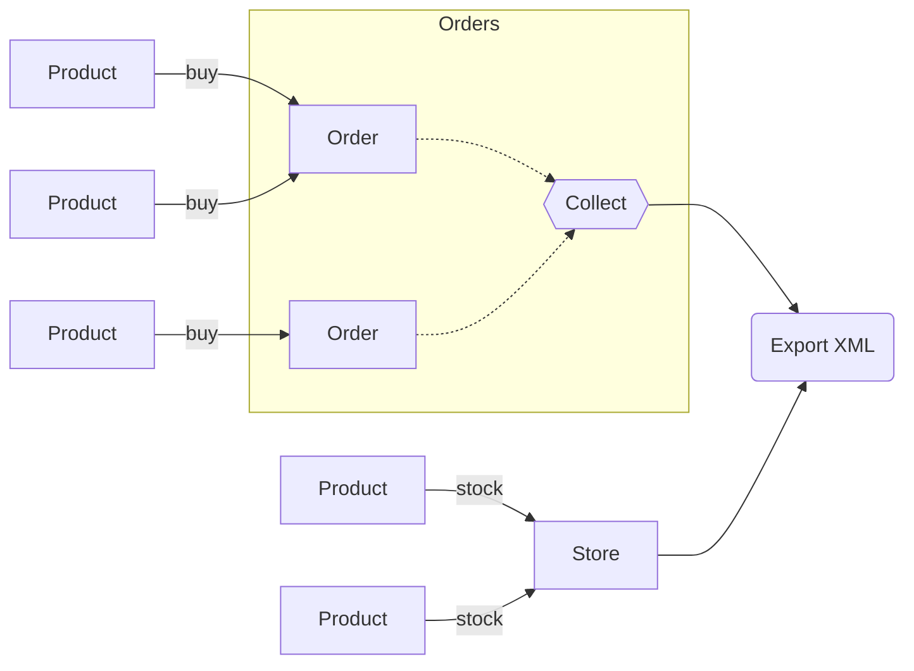

# Example: Product Export



::right::

<div class="py-12" />

<v-click>

```xml
<orders>
  <order id="O1">
    <product id="P1" weight="0.5">
    <price currency="USD">
      149.99
    </price>
    Product One
    </product>
    ...
  </order>
  ...
</orders>
```

</v-click>
